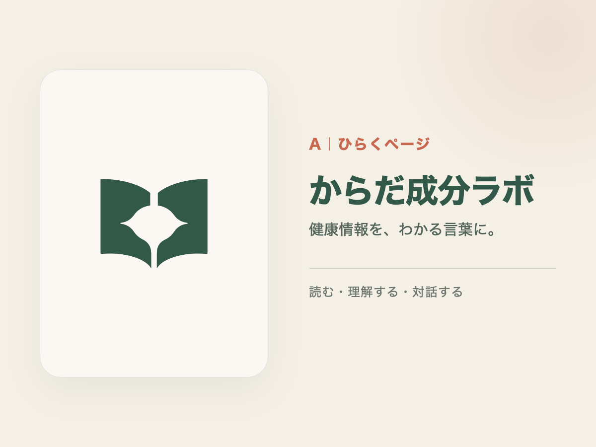
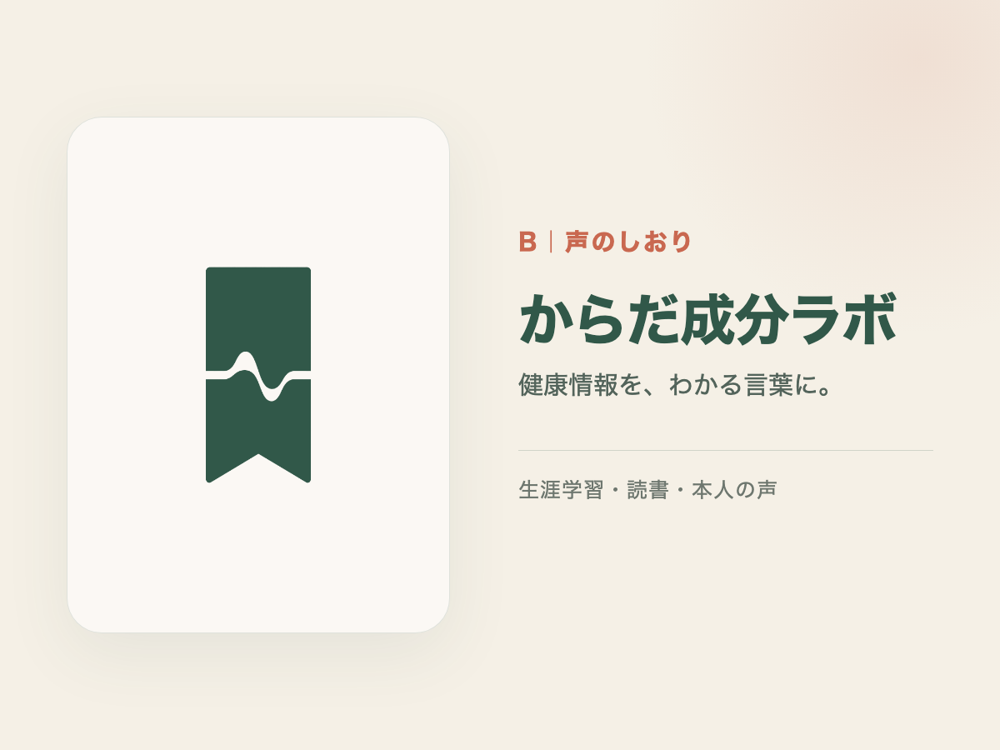
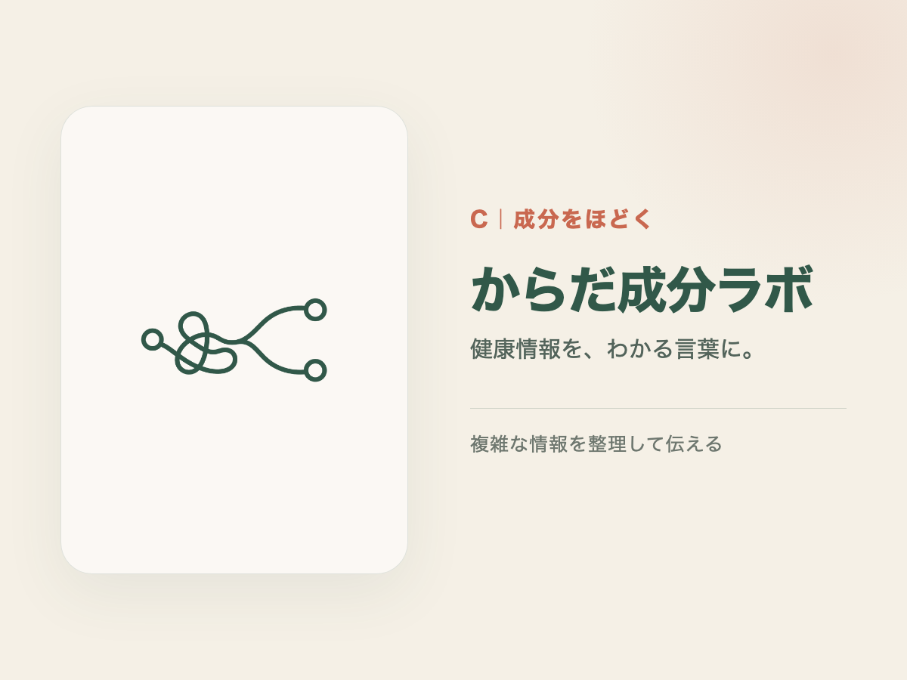

# からだ成分ラボ ロゴコンセプト3案

最終更新: 2026-07-27

ブランドの核は「健康情報を、わかる言葉に。」。健康食品会社や医療機関のように見せず、本を読み、調べ、漫画と本人の声で伝える「小さな出版社」を目指す。

## 共通条件

- 一色で成立する
- 32pxでも輪郭を識別できる
- カプセル、DNAらせん、医療十字、葉、ハートを使わない
- 核酸以外の健康情報へ展開できる
- 基本色は深緑`#315849`
- 背景色は生成り`#F5F0E6`
- 差し色は朱色`#C96850`

## A｜ひらくページ

開いた本を二枚の曲線で表し、中央の余白を対話や声に見立てる。読書、理解、漫画、説明を一つの形にまとめた案。

長所:

- ブランドの「読む・伝える」に最も直結する
- 出版社・教育媒体としての信頼感がある
- 将来の書籍、資料、サイトにも展開しやすい

注意点:

- 中央の余白形状を、最終ベクター化でさらに簡潔にする

## B｜声のしおり

読書を続ける「しおり」と、本人の穏やかな声を表す一つの波形を組み合わせた案。

長所:

- 植井寛の声を活用する方針が伝わる
- 縦長で、動画のコーナーマークやハイライトに使いやすい
- 生涯学習の象徴として分かりやすい

注意点:

- 波形が強すぎると音声配信サービスに見えるため、文字との組み合わせが重要

## C｜成分をほどく

絡まった一本の線が、三つの整理された点へほどけていく。複雑な健康情報を分解し、理解できる形へ整理する活動そのものを表す案。

長所:

- 他の健康ブランドと重なりにくい
- 漫画や動画で「絡まりから整理へ」の動きを付けやすい
- 研究、成分、情報整理を抽象的に表現できる

注意点:

- 小サイズでは線が細くなるため、アイコン版では形の単純化が必要

## デザイナー推奨

第一候補はA「ひらくページ」。ブランドの現在と将来を最も広く受け止められる。Bの音声要素は動画シリーズのサブマーク、Cの線は動画オープニングのモーションとして再利用できる。

採用案決定後に行うこと:

1. AI生成画像をそのまま最終ロゴにせず、単純な幾何形状でSVGへ再設計する
2. 横組み、縦組み、アイコン単体、白抜きの4形式を作る
3. 16px、32px、プロフィール円形、Instagram投稿上で縮小確認する
4. 類似する既存ロゴ・商標を確認する
